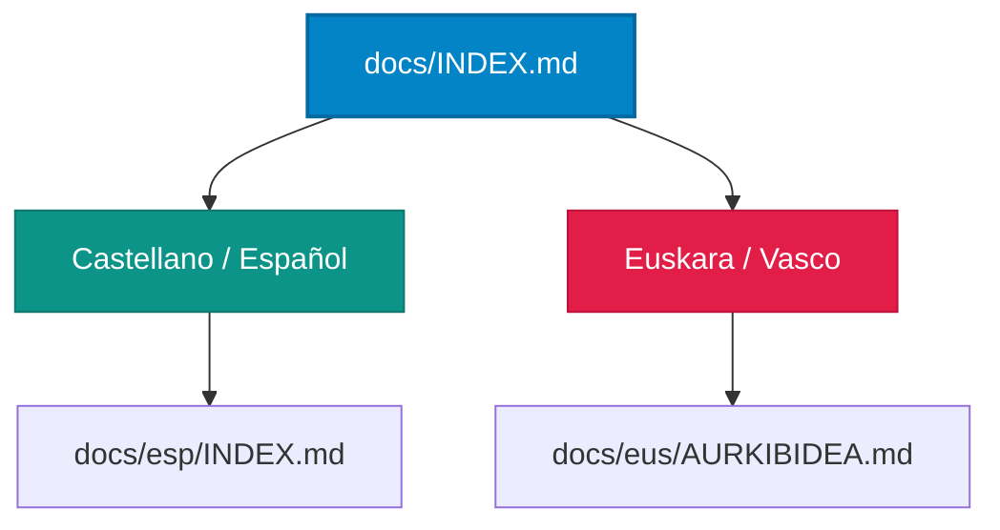

# 📟 BiosenseLink - Portal de Documentación / Dokumentazio Ataria

Bienvenido al portal de documentación de la plataforma **BiosenseLink** (IoMT & CDSS).
Ongi etorri **BiosenseLink** (IoMT & CDSS) plataformaren dokumentazio atarira.

---

## 🗺️ Selecciona tu Idioma / Hautatu zure hizkuntza

Por favor, selecciona la carpeta de documentación en el idioma de tu preferencia:
Mesedez, hautatu dokumentazio-karpeta nahiago duzun hizkuntzan:

### 🇪🇸 Castellano / Español
*   **[Ir al Índice en Español (docs/esp/INDEX.md)](file:///c:/Dev/05_Projects/Biomedical_IoMT/BiosenseLink/docs/esp/INDEX.md)**: Acceso completo a los 7 documentos técnicos sobre arquitectura, base de datos, simulación matemática de McSharry, integración HL7 FHIR R4, osciloscopio en Canvas HTML5 y guía de despliegue local de la suite.

### 🇪🇺 Euskara / Vasco
*   **[Euskarazko aurkibidera joan (docs/eus/AURKIBIDEA.md)](file:///c:/Dev/05_Projects/Biomedical_IoMT/BiosenseLink/docs/eus/AURKIBIDEA.md)**: Sarbide osoa arkitektura, datu-basea, McSharry simulazio matematikoa, HL7 FHIR R4 integrazioa, Canvas HTML5 osziloskopioa eta instalazio gida azaltzen duten 7 dokumentu teknikoetara.

---

## 🔬 Referencias de Investigación / Ikerketa Erreferentziak
1.  **McSharry PE, et al.** (2003). *A dynamical model for generating synthetic electrocardiogram signals.* IEEE Trans Biomed Eng.
2.  **Pan J, Tompkins WJ.** (1985). *A real-time QRS detection algorithm.* IEEE Trans Biomed Eng.
3.  **Sutton RT, et al.** (2020). *An overview of clinical decision support systems: benefits, risks, and strategies for success.* NPJ Digital Medicine.
4.  **HL7 International.** *FHIR R4 Framework for Digital Health Interoperability.*
