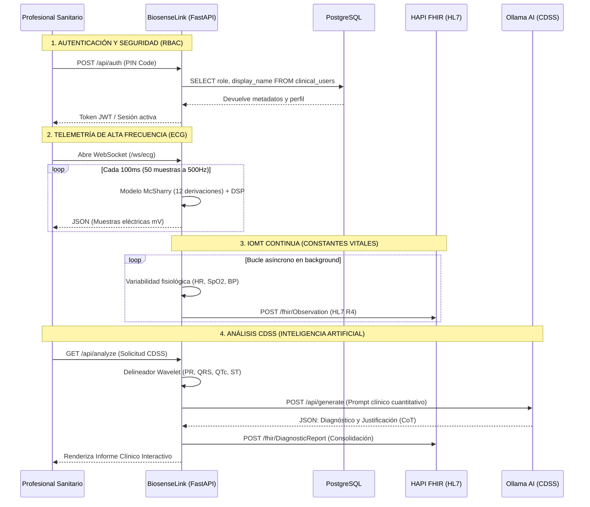

# 🏗️ Arquitectura General de BiosenseLink (IoMT & CDSS Gateway)

Este documento detalla la arquitectura de software, la topología de red, el mapeo de puertos y los flujos de datos en tiempo real de la suite **BiosenseLink**. La plataforma está diseñada bajo un enfoque de **microservicios unificados Edge-to-Cloud**, integrando telemetría de alta frecuencia (Internet of Medical Things - IoMT) y un Sistema de Soporte a las Decisiones Clínicas (CDSS) basado en Inteligencia Artificial Generativa.

---

## 1. Topología del Sistema y Distribución de Puertos

BiosenseLink opera combinando contenedores de Docker clínicos y un servidor local en Python (FastAPI). La red se estructura para garantizar baja latencia en el procesado de bioseñales y alta interoperabilidad mediante estándares sanitarios.

| Servicio / Contenedor | Puerto Local | Protocolo | Descripción / Función Técnica (Biomedical & DAM) |
| :--- | :--- | :--- | :--- |
| **HAPI FHIR Server** | `8080` | HTTP / REST | Servidor de base de datos e interoperabilidad clínica bajo el estándar **HL7 FHIR R4**. Almacena recursos transaccionales (`Patient`, `Observation`, `DiagnosticReport`). Central para la integración con HCE (Historia Clínica Electrónica). |
| **BiosenseLink Gateway** | `8081` | HTTP / WS | Servidor Edge en **FastAPI**. Sirve la interfaz Web SCADA estática, gestiona el WebSocket de ECG a alta frecuencia (500Hz) y coordina el pipeline de Procesamiento Digital de Señales (DSP) para extracción de características clínicas. |
| **PostgreSQL Database** | `5432` | TCP/IP | Base de datos relacional para la gestión local de usuarios clínicos, control de acceso basado en roles (RBAC) y auditoría de eventos de seguridad médica. |
| **pgAdmin 4** | `5050` | HTTP / HTML | Consola web de administración visual para PostgreSQL en el entorno local. Útil para DBA y SysAdmins. |
| **Ollama Local Engine** | `11434` | HTTP / REST | Motor de inferencia local de IA (LLM). Ejecuta **DeepSeek-R1 (8B)** para razonamiento clínico y generación de reportes diagnósticos estructurados, operando en entorno aislado (Air-Gapped) para preservar la privacidad del paciente (HIPAA/GDPR compliance). |

---

## 2. Mapa de Flujo de Datos en Tiempo Real (Dataflow)

La interconexión entre la interfaz del usuario, el motor de telemetría y los servidores clínicos se organiza en dos canales principales: **Streaming Asíncrono (WebSockets)** para la señal de ECG, y **REST APIs** para los flujos clínicos transaccionales.

---

## 3. Arquitectura del Backend y Especificaciones Científicas

El backend está desarrollado en **Python 3 (asyncio)** para maximizar la concurrencia en la adquisición de datos biomédicos.

### 3.1. `server.py` (Orquestador IoMT Gateway)
*   **Rol**: Controlador principal (Edge Gateway).
*   **Especificación**: Utiliza `uvicorn` sobre FastAPI. Integra un Task asíncrono que simula el flujo constante de sensores embebidos (SpO2, NIBP, Capnografía) y emite los paquetes de telemetría directamente al servidor FHIR sin scripts externos.

### 3.2. `ecg_simulator.py` (Generador de Dinámica Cardíaca)
*   **Rol**: Simulación biomédica sintética de 12 derivaciones.
*   **Especificación**: Basado en el modelo de McSharry et al. (IEEE Trans Biomed Eng). Emplea un sistema de ecuaciones diferenciales acopladas para generar el vector dipolo del corazón (PQRST) y lo proyecta espacialmente usando la matriz de transformación de Dower inversa. Incluye perfiles de arritmogenia (Fibrilación Auricular, Taquicardia Ventricular).

### 3.3. `signal_processor.py` (DSP & Filtrado Biomédico)
*   **Rol**: Limpieza de bioseñales.
*   **Especificación**: Aplica filtros de respuesta al impulso infinito (IIR) tipo Butterworth paso-banda (0.5 - 40 Hz) de fase cero (`scipy.signal.filtfilt`) para remover ruido mioeléctrico y artefactos de movimiento. Incluye un filtro Notch (50/60Hz) para interferencias de la red eléctrica.

### 3.4. `pqrst_analyzer.py` (Morfología y Delineación)
*   **Rol**: Extracción de características clínicas (Feature Extraction).
*   **Especificación**: Implementa detectores basados en Transformada Wavelet Continua (CWT) y el algoritmo Pan-Tompkins para detección robusta del complejo QRS. Mide intervalos críticos (PR, duración QRS) y aplica la fórmula de Bazett ($QTc = QT / \sqrt{RR}$) para el riesgo de Torsades de Pointes. Cuantifica desviaciones del segmento ST en milivoltios para detectar isquemia miocárdica aguda (STEMI/NSTEMI).

### 3.5. `clinical_interpreter.py` (Motor CDSS)
*   **Rol**: Sistema Experto basado en IA.
*   **Especificación**: Construye un contexto sintáctico para el LLM. Inyecta métricas precisas (ej. "Elevación ST de 2.5mm en V2-V4") y exige razonamiento clínico (Chain-of-Thought) basándose en las guías de práctica clínica de la ESC (European Society of Cardiology) / AHA (American Heart Association).

### 3.6. `fhir_exporter.py` (Interoperabilidad HL7)
*   **Rol**: Transformación de esquemas (Mapping).
*   **Especificación**: Mapea variables locales a vocabularios médicos estandarizados (LOINC para observaciones de laboratorio/señales, SNOMED CT para diagnósticos). Agrupa todos los hallazgos en un bundle `DiagnosticReport` asegurando la persistencia semántica en la HCE.
