# 📟 Portal de Documentación Científica y Técnica: BiosenseLink

Bienvenido a la documentación oficial de **BiosenseLink**, una suite Point-of-Care (PoC) e IoMT (Internet of Medical Things) de grado clínico y arquitectónico profesional. Esta plataforma unificada permite la simulación, procesamiento, almacenamiento e interpretación de trazados electrocardiográficos (ECG) de 12 derivaciones y constantes vitales a tiempo real.

Este conjunto de documentos ha sido diseñado bajo los estándares rigurosos de la **Ingeniería Biomédica** y del **Desarrollo de Aplicaciones Multiplataforma (DAM) de Nivel Senior**.

---

## 🗺️ Mapa de Navegación de la Suite

Haz clic en cualquiera de las secciones para acceder a la especificación técnica correspondiente:

```mermaid
graph TD
    Index[docs/esp/INDEX.md] --> Arch[docs/esp/1_ARCHITECTURE_OVERVIEW.md]
    Index --> DB[docs/esp/2_DATABASE_SCHEMA.md]
    Index --> Bio[docs/esp/3_BIOMEDICAL_SIMULATION.md]
    Index --> FHIR[docs/esp/4_FHIR_INTEGRATION.md]
    Index --> Front[docs/esp/5_FRONTEND_CONSOLE.md]
    Index --> Setup[docs/esp/6_SETUP_GUIDE.md]
    Index --> Users[docs/esp/7_CLINICAL_USERS_AND_PATIENTS.md]

    style Index fill:#0284c7,stroke:#0369a1,stroke-width:2px,color:#fff
    style Arch fill:#0d9488,stroke:#0f766e,color:#fff
    style DB fill:#0f766e,stroke:#115e59,color:#fff
    style Bio fill:#e11d48,stroke:#be123c,color:#fff
    style FHIR fill:#2563eb,stroke:#1d4ed8,color:#fff
    style Front fill:#7c3aed,stroke:#6d28d9,color:#fff
    style Setup fill:#4b5563,stroke:#374151,color:#fff
    style Users fill:#ea580c,stroke:#c2410c,color:#fff
```

### 1. [Arquitectura General e Interconexión (1_ARCHITECTURE_OVERVIEW.md)](file:///c:/Dev/05_Projects/Biomedical_IoMT/BiosenseLink/docs/esp/1_ARCHITECTURE_OVERVIEW.md)
*   **Orquestación de Puertos**: Configuración de red unificada bajo el puerto `8081`.
*   **Servicios Activos**: Mapeo completo de contenedores Docker (PostgreSQL, HAPI FHIR, pgAdmin, Ollama) y el servidor FastAPI.
*   **Comunicación Bidireccional**: Protocolo WebSocket para transmisión de ECG de alta frecuencia y API REST de control de constantes vitales.

### 2. [Esquema de Base de Datos y Ciberseguridad (2_DATABASE_SCHEMA.md)](file:///c:/Dev/05_Projects/Biomedical_IoMT/BiosenseLink/docs/esp/2_DATABASE_SCHEMA.md)
*   **Persistencia Local**: Estructura de PostgreSQL en Docker para almacenar usuarios clínicos (`clinical_users`) y pacientes (`patients`).
*   **Seguridad y Autenticación**: Sistema de login por PIN clínico con encriptación y control de accesos basado en roles (RBAC - Administrador Clínico vs. Enfermero).

### 3. [Modelado de Señal y Simulación Fisiológica (3_BIOMEDICAL_SIMULATION.md)](file:///c:/Dev/05_Projects/Biomedical_IoMT/BiosenseLink/docs/esp/3_BIOMEDICAL_SIMULATION.md)
*   **Fundamento Matemático**: Simulación sintética del complejo PQRST mediante el modelo dinámico tridimensional de McSharry (ODE).
*   **Topografía Cardíaca**: Proyección espacial de las 12 derivaciones estándar (Bipolares I-III, Monopolares aumentadas aVR-aVF, Precordiales V1-V6).
*   **Procesamiento Digital**: Filtros paso banda Butterworth IIR de fase cero (`filtfilt`) y Notch de 50 Hz para interferencias de red.
*   **Algoritmo Pan-Tompkins**: Detección analítica de ondas R en tiempo real.

### 4. [Interoperabilidad y HL7 FHIR (4_FHIR_INTEGRATION.md)](file:///c:/Dev/05_Projects/Biomedical_IoMT/BiosenseLink/docs/esp/4_FHIR_INTEGRATION.md)
*   **HAPI FHIR**: Estructura R4 para Observations y DiagnosticReports.
*   **Telemetría IoT**: Funcionamiento del bucle asíncrono continuo de vitales (`continuous_vitals_simulator`) con variabilidad fisiológica realista.
*   **Mapeos LOINC y SNOMED CT**: Codificación internacional de constantes vitales.

### 5. [Consola Web SCADA y Visualización (5_FRONTEND_CONSOLE.md)](file:///c:/Dev/05_Projects/Biomedical_IoMT/BiosenseLink/docs/esp/5_FRONTEND_CONSOLE.md)
*   **Osciloscopio Digital**: Algoritmo de dibujo sobre Canvas HTML5 con cuadrícula milimétrica biomédica de alta precisión.
*   **Maquetación Clínica Standard (4x3+1)**: Distribución espacial de derivaciones hospitalarias y la tira de ritmo DII.
*   **Despliegue Local**: Mecanismo de arranque del visualizador de escritorio 3D (`main.py`) en un subproceso de Windows mediante FastAPI.

### 6. [Guía de Instalación y Puesta en Marcha (6_SETUP_GUIDE.md)](file:///c:/Dev/05_Projects/Biomedical_IoMT/BiosenseLink/docs/esp/6_SETUP_GUIDE.md)
*   **Instalación Rápida**: Requisitos, entorno virtual Python y Docker.
*   **Lanzador Maestro**: Uso de `Lanzar_BiosenseLink.ps1` y `Lanzar_BiosenseLink.bat` para el inicio unificado en un solo clic.

### 7. [Usuarios Clínicos y Pacientes (7_CLINICAL_USERS_AND_PATIENTS.md)](file:///c:/Dev/05_Projects/Biomedical_IoMT/BiosenseLink/docs/esp/7_CLINICAL_USERS_AND_PATIENTS.md)
*   **Usuarios en PostgreSQL**: Roles y PINs de acceso para inicio de sesión en el portal (Dr. Ander Otxoa, Enf. Amaia Ruiz, Administrador).
*   **Gestión de Pacientes (HL7 FHIR)**: Carga del perfil predeterminado y alta en caliente de nuevos pacientes en el servidor HAPI FHIR.

---

## 🔬 Referencias de Investigación Científica
Este proyecto no es una simple simulación web; está respaldado por investigaciones científicas publicadas en revistas internacionales de ingeniería biomédica y medicina:
1.  **McSharry PE, et al.** (2003). *A dynamical model for generating synthetic electrocardiogram signals.* IEEE Trans Biomed Eng. (Simulador ECG).
2.  **Pan J, Tompkins WJ.** (1985). *A real-time QRS detection algorithm.* IEEE Trans Biomed Eng. (Detección de latidos).
3.  **Sutton RT, et al.** (2020). *An overview of clinical decision support systems: benefits, risks, and strategies for success.* NPJ Digital Medicine. (Marco CDSS).
4.  **HL7 International.** *FHIR R4 Framework for Digital Health Interoperability.* (Estándares de intercambio clínico).
