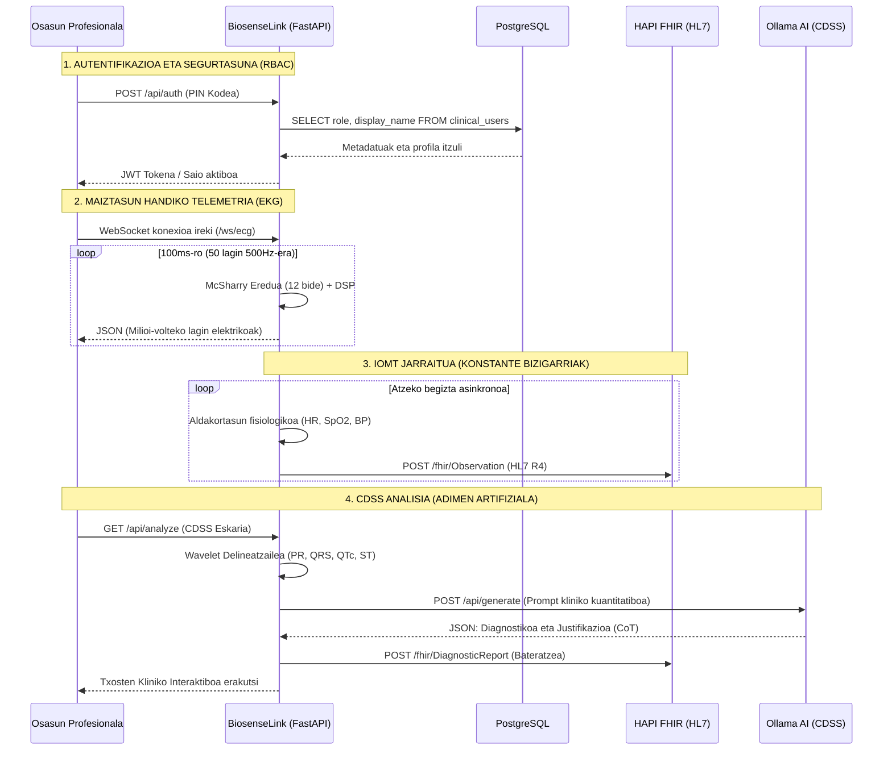

# 🏗️ BiosenseLink-en Arkitektura Orokorra (IoMT eta CDSS Pasabidea)

Dokumentu honek **BiosenseLink** plataformaren software-arkitektura, sare-topologia, ataken mapa eta denbora errealeko datuen fluxuak zehazten ditu. Sistema hau **Edge-to-Cloud mikrozerbitzu bateratuen** ikuspegipean diseinatuta dago, maiztasun handiko telemetria (Internet of Medical Things - IoMT) eta Adimen Artifizial Sortzailean oinarritutako Erabaki Klinikoak Babesteko Sistema (CDSS) integratuz.

---

## 1. Sistemaren Topologia eta Ataken Banaketa

BiosenseLink-ek Docker edukiontzi klinikoak eta Python-en (FastAPI) idatzitako tokiko zerbitzari bat konbinatzen ditu. Sarea latentzia txikiko bioseinaleen prozesamendua eta osasun-estandarren bidezko elkarreragingarritasun handia bermatzeko egituratuta dago.

| Zerbitzua / Edukiontzia | Tokiko Ataka | Protokoloa | Azalpen Teknikoa (Biomedikuntza eta DAM) |
| :--- | :--- | :--- | :--- |
| **HAPI FHIR Server** | `8080` | HTTP / REST | Elkarreragingarritasun klinikorako zerbitzaria, **HL7 FHIR R4** estandarraren azpian. Baliabide transakzionalak (`Patient`, `Observation`, `DiagnosticReport`) gordetzen ditu. HKE (Historia Kliniko Elektronikoa) integrazioaren muina. |
| **BiosenseLink Gateway** | `8081` | HTTP / WS | **FastAPI** Edge zerbitzaria. Web SCADA interfaze estatikoa hornitzen du, maiztasun handiko (500Hz) EKG WebSocket-a kudeatzen du eta ezaugarri klinikoak ateratzeko Seinaleen Prozesamendu Digitalaren (DSP) fluxua koordinatzen du. |
| **PostgreSQL Database** | `5432` | TCP/IP | Erabiltzaile klinikoen kudeaketarako, roletan oinarritutako sarbide-kontrolerako (RBAC) eta segurtasun medikoaren gertaeren auditoriarako datu-base erlazionala. |
| **pgAdmin 4** | `5050` | HTTP / HTML | PostgreSQL datu-basea kudeatzeko administrazio-kontsola bisuala tokiko garapen-ingurunean. DBA eta SysAdmin erabiltzaileentzat erabilgarria. |
| **Ollama Local Engine** | `11434` | HTTP / REST | Adimen Artifizialeko (LLM) tokiko inferentzia-motorra. **DeepSeek-R1 (8B)** exekutatzen du arrazoibide klinikorako eta txosten diagnostiko egituratuak sortzeko, ingurune isolatuan (Air-Gapped) jardunez, pazientearen pribatutasuna babesteko (HIPAA/GDPR betetzea). |

---

## 2. Denbora Errealeko Datuen Fluxua (Dataflow)

Erabiltzailearen interfazearen, telemetria-motorraren eta zerbitzari klinikoen arteko komunikazioa bi kanal nagusitan antolatzen da: **Streaming Asinkronoa (WebSockets)** EKG seinalerako, eta **REST APIak** datu kliniko transakzionaletarako.

---

## 3. Backend-aren Arkitektura eta Zehaztapen Zientifikoak

Backend-a **Python 3 (asyncio)** erabiliz garatu da, datu biomedikoen eskuratzean konkurrentzia maximizatzeko.

### 3.1. `server.py` (IoMT Gateway Orquestatzailea)
*   **Rola**: Kontrolagailu nagusia (Edge Gateway).
*   **Zehaztapena**: `uvicorn` erabiltzen du FastAPI gainean. Sentsore txertatuen (SpO2, NIBP, Kapnografia) fluxu jarraitua simulatzen duen zeregin asinkronoa (Task) integratzen du, telemetria paketeak zuzenean FHIR zerbitzarira bidaliz kanpoko script-en beharrik gabe.

### 3.2. `ecg_simulator.py` (Bihotz Dinamikaren Sortzailea)
*   **Rola**: 12 bideko simulazio biomediko sintetikoa.
*   **Zehaztapena**: McSharry et al. ereduan oinarritua (IEEE Trans Biomed Eng). Ekuazio diferentzial akoplatuen sistema bat erabiltzen du bihotzaren bektore dipoloa (PQRST) sortzeko, eta espazialki proiektatzen du Dower-en transformazio matrize alderantzikatuaren bidez. Arritmia-profilak barne hartzen ditu (Fibrilazio Aurikularra, Takikardia Bentrikularra).

### 3.3. `signal_processor.py` (DSP eta Iragazki Biomedikoak)
*   **Rola**: Bioseinaleen garbiketa.
*   **Zehaztapena**: Fase zeroko (`scipy.signal.filtfilt`) Butterworth banda-paseko (0.5 - 40 Hz) erantzun infinituko (IIR) iragazkiak aplikatzen ditu zarata mioelektrikoa eta mugimendu-artefaktuak kentzeko. Notch iragazki bat (50/60Hz) gehitzen du sare elektrikoaren interferentzietarako.

### 3.4. `pqrst_analyzer.py` (Morfologia eta Delineazioa)
*   **Rola**: Ezaugarri klinikoen erauzketa (Feature Extraction).
*   **Zehaztapena**: Wavelet Transformatu Jarraituan (CWT) eta Pan-Tompkins algoritmoan oinarritutako detektagailuak inplementatzen ditu QRS konplexuaren detekzio sendorako. Tarte kritikoak neurtzen ditu (PR, QRS iraupena) eta Bazett-en formula aplikatzen du ($QTc = QT / \sqrt{RR}$) Torsades de Pointes arriskurako. ST segmentuaren desbideratzeak kuantifikatzen ditu milivoltetan iskemia miokardiko akutua (STEMI/NSTEMI) detektatzeko.

### 3.5. `clinical_interpreter.py` (CDSS Motorra)
*   **Rola**: IA-n oinarritutako Sistema Aditua.
*   **Zehaztapena**: LLMrentzako testuinguru sintaktikoa eraikitzen du. Metrika zehatzak txertatzen ditu (adib. "ST igoera 2.5mm V2-V4 bideetan") eta arrazoibide klinikoa (Chain-of-Thought) eskatzen du ESC (European Society of Cardiology) / AHA (American Heart Association) praktika klinikoaren gidetan oinarrituz.

### 3.6. `fhir_exporter.py` (HL7 Elkarreragingarritasuna)
*   **Rola**: Eskemen transformazioa (Mapping-a).
*   **Zehaztapena**: Aldagai lokalak hiztegi mediko estandarizatuetara mapatzen ditu (LOINC laborategiko behaketetarako/seinaleetarako, SNOMED CT diagnostikoetarako). Aurkikuntza guztiak `DiagnosticReport` bundle batean biltzen ditu, HKEan iraupen semantikoa bermatuz.
