# 📟 Dokumentazio Zientifiko eta Teknikoaren Ataria: BiosenseLink

Ongi etorri **BiosenseLink**-en dokumentazio ofizialera. Kalitate kliniko handiko eta arkitektura profesionaleko Point-of-Care (PoC) eta IoMT (Internet of Medical Things) plataforma bat da hau. Sistema bateratu honek 12 bideko trazatu elektrokardiografikoen (EKG) eta konstante bizigarrien simulazioa, prozesamendua, biltegiratzea eta interpretazioa ahalbidetzen du denbora errealean.

Dokumentazio multzo hau **Ingeniaritza Biomedikoaren** eta **Nivel Seniorreko Multiplataforma Aplikazioen Garapenaren (DAM)** estandar zorrotzen arabera diseinatu da.

---

## 🗺️ Nabigazio Atala

Egin klik edozein ataletan dagokion zehaztapen tekniko edo medikora sartzeko:

```mermaid
graph TD
    Index[docs/eus/AURKIBIDEA.md] --> Arch[docs/eus/1_ARKITEKTURA_OROKORRA.md]
    Index --> DB[docs/eus/2_DATU_BASEAREN_ESKEMA.md]
    Index --> Bio[docs/eus/3_SIMULAZIO_BIOMEDIKOA.md]
    Index --> FHIR[docs/eus/4_FHIR_INTEGRAZIOA.md]
    Index --> Front[docs/eus/5_FRONTEND_KONSOLA.md]
    Index --> Setup[docs/eus/6_INSTALAZIO_GIDA.md]

    style Index fill:#0284c7,stroke:#0369a1,stroke-width:2px,color:#fff
    style Arch fill:#0d9488,stroke:#0f766e,color:#fff
    style DB fill:#0f766e,stroke:#115e59,color:#fff
    style Bio fill:#e11d48,stroke:#be123c,color:#fff
    style FHIR fill:#2563eb,stroke:#1d4ed8,color:#fff
    style Front fill:#7c3aed,stroke:#6d28d9,color:#fff
    style Setup fill:#4b5563,stroke:#374151,color:#fff
```

### 1. [Arkitektura Orokorra eta Konexioak (1_ARKITEKTURA_OROKORRA.md)](file:///c:/Dev/05_Projects/Biomedical_IoMT/BiosenseLink/docs/eus/1_ARKITEKTURA_OROKORRA.md)
*   **Atariko Orkestrazioa**: Sare konfigurazio bateratua `8081` atakan.
*   **Zerbitzu Aktiboak**: Docker edukiontzien (PostgreSQL, HAPI FHIR, pgAdmin, Ollama) eta FastAPI zerbitzariaren mapa osoa.
*   **Norabide Bikoitzeko Komunikazioa**: WebSocket protokoloa maiztasun handiko EKG seinaleetarako eta REST APIa konstanteak kontrolatzeko.

### 2. [Datu-Basearen Eskema eta Zibersegurtasuna (2_DATU_BASEAREN_ESKEMA.md)](file:///c:/Dev/05_Projects/Biomedical_IoMT/BiosenseLink/docs/eus/2_DATU_BASEAREN_ESKEMA.md)
*   **Tokiko Iraunkortasuna**: PostgreSQL Docker-en, erabiltzaile klinikoak (`clinical_users`) eta pazienteak (`patients`) gordetzeko.
*   **Segurtasuna eta Autentifikazioa**: Saio hasiera azkarra PIN kode bidez eta roletan oinarritutako sarbide-kontrola (RBAC - Administratzaile Klinikoa vs. Erizaina).

### 3. [Seinalearen Modelaketa eta Simulazio Fisiologikoa (3_SIMULAZIO_BIOMEDIKOA.md)](file:///c:/Dev/05_Projects/Biomedical_IoMT/BiosenseLink/docs/eus/3_SIMULAZIO_BIOMEDIKOA.md)
*   **Oinarri Matematikoa**: PQRST konplexuaren simulazio sintetikoa McSharryren hiru dimentsioko eredu dinamikoaren bidez (ODE).
*   **Topografia Kardiakoa**: 12 bide estandarren banaketa espaziala (Bipolarrak I-III, Monopolar areagotuak aVR-aVF, Prekodialak V1-V6).
*   **Procesamendu Digitala**: Butterworth IIR iragazkiak (fase zero `filtfilt`) eta Notch 50 Hz-eko iragazkia sareko interferentziak ezabatzeko.
*   **Pan-Tompkins Algoritmoa**: R uhinen detekzio analitikoa denbora errealean.

### 4. [Interoperabilitatea eta HL7 FHIR (4_FHIR_INTEGRAZIOA.md)](file:///c:/Dev/05_Projects/Biomedical_IoMT/BiosenseLink/docs/eus/4_FHIR_INTEGRAZIOA.md)
*   **HAPI FHIR**: R4 egitura `Observation` eta `DiagnosticReport` baliabideetarako.
*   **IoT Telemetria**: `continuous_vitals_simulator` begizta asinkronoaren funtzionamendua, aldaera fisiologiko errealistekin.
*   **LOINC eta SNOMED CT Mapeoak**: Konstante bizigarrien eta diagnostiko kardiakoen kodeketa estandarizatua.

### 5. [Web SCADA Konsola eta Bisualizazioa (5_FRONTEND_KONSOLA.md)](file:///c:/Dev/05_Projects/Biomedical_IoMT/BiosenseLink/docs/eus/5_FRONTEND_KONSOLA.md)
*   **Osziloskopio Digitala**: HTML5 Canvas gainean marrazteko algoritmoa, zehaztasun handiko sare milimetratu biomedikoarekin.
*   **Maquetazio Kliniko Estandarra (4x3+1)**: Bideen banaketa kardiako ospitalarioa eta DII erritmo banda jarraitua azpiko aldean.
*   **Mahaigaineko Integrazioa**: Nabigatzailetik `main.py` mahaigaineko 3D bisualizatzailea abiarazteko mekanismoa FastAPI bidez.

### 6. [Instalazio Gida eta Abiaraztea (6_INSTALAZIO_GIDA.md)](file:///c:/Dev/05_Projects/Biomedical_IoMT/BiosenseLink/docs/eus/6_INSTALAZIO_GIDA.md)
*   **Instalazio Azkarra**: Baldintzak, Python ingurune birtuala eta Docker.
*   **Abiarazle Bateratua**: `Lanzar_BiosenseLink.ps1` eta `Lanzar_BiosenseLink.bat` klik bakarrean suite osoa martxan jartzeko.

---

## 🔬 Ikerketa Zientifikoko Erreferentziak
Proiektu honek oinarri zientifiko sendoak ditu, nazioarteko ingeniaritza biomedikoko aldizkarietan argitaratuak:
1.  **McSharry PE, et al.** (2003). *A dynamical model for generating synthetic electrocardiogram signals.* IEEE Trans Biomed Eng. (EKG simulagailua).
2.  **Pan J, Tompkins WJ.** (1985). *A real-time QRS detection algorithm.* IEEE Trans Biomed Eng. (Bihotz-taupaden detekzioa).
3.  **Sutton RT, et al.** (2020). *An overview of clinical decision support systems: benefits, risks, and strategies for success.* NPJ Digital Medicine. (CDSS ingurunea).
4.  **HL7 International.** *FHIR R4 Framework for Digital Health Interoperability.* (Datuen truke klinikoa).
