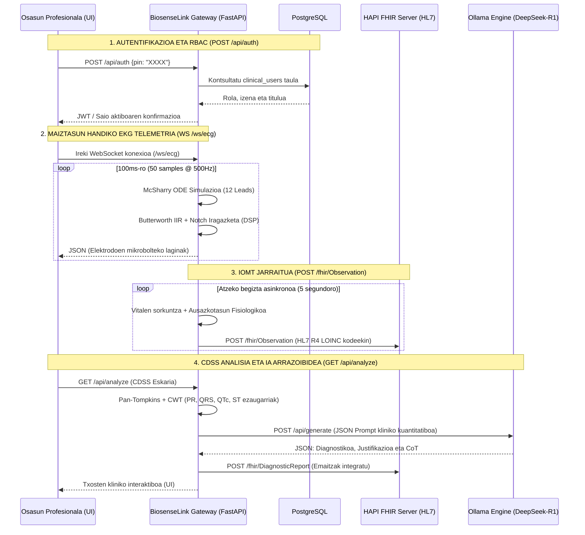

# 🔄 BiosenseLink - Denbora Errealeko Datuen Fluxua (Dataflow) Zehatza

Dokumentu honek **BiosenseLink** plataformaren denbora errealeko datu-fluxua (Dataflow) deskribatzen du xehetasun tekniko, arkitektoniko eta zientifikoekin. Sistema hau IoMT (Internet of Medical Things) telemetria eta CDSS (Clinical Decision Support System) erabaki klinikoak babesteko sistema adimenduna integratzen dituen Edge-to-Cloud pasabide bat da.

Datu-fluxu osoa 4 bloke edo fase nagusitan antolatzen da, [1_ARKITEKTURA_OROKORRA.md](file:///C:/Dev/05_Projects/Biomedical_IoMT/BiosenseLink/docs/eus/1_ARKITEKTURA_OROKORRA.md) fitxategiko sekuentzia-diagramaren arabera:



---

## 📂 1. Autentifikazioa eta Segurtasuna (RBAC)

Osasun-profesionalak aplikaziora sartzeko eta Roletan Oinarritutako Sarbide Kontrola (RBAC - Role-Based Access Control) egiaztatzeko fasea da.

*   **Endpoint-a:** `POST /api/auth`
*   **FastAPI Kudeatzailea:** `authenticate(req: LoginRequest)` [server.py:L526-L547](file:///C:/Dev/05_Projects/Biomedical_IoMT/BiosenseLink/scripts/server.py#L526-L547)
*   **Fluxua Pausoz Pauso:**
    1.  **Eskaera:** Erabiltzaileak (Frontend UI) bere PIN kode pertsonala bidaltzen dio Gateway-ari (`LoginRequest` eredua).
    2.  **Datu-base konexioa:** Gateway-ak konexio bat irekitzen du PostgreSQL zerbitzariarekin (`5432` ataka) `psycopg2` liburutegia erabiliz eta `medical_platform` datu-basera jotzen du.
    3.  **SQL Egiaztapena:** SQL query baten bidez PIN kodea egiaztatzen da:
        ```sql
        SELECT role, display_name, title FROM clinical_users WHERE pin = %s
        ```
    4.  **Erantzuna:** Erabiltzailea aurkitzen bada, bere rola (`clinical_admin` edo `nurse`), izena eta kargua bueltatzen ditu APIak, bezeroaren saioa eta baimen klinikoak aktibatuz.

---

## 📈 2. Maiztasun Handiko Telemetria (EKG Seinalea)

Bihotz-seinalea (EKG) denbora errealean marrazteko streaming kanala da, maiztasun eta zehaztasun biomediko handiarekin funtzionatzen duena.

*   **Endpoint-a:** WebSocket `/ws/ecg`
*   **FastAPI Kudeatzailea:** `websocket_ecg_endpoint(websocket: WebSocket)` [server.py:L692-L754](file:///C:/Dev/05_Projects/Biomedical_IoMT/BiosenseLink/scripts/server.py#L692-L754)
*   **Fluxua Pausoz Pauso:**
    1.  **Konexioa:** Frontend-ak WebSocket konexio bat irekitzen du `ws://localhost:8081/ws/ecg` helbidean. Gateway-ak konexioa onartu eta bezero aktiboen zerrendan (`state["active_connections"]`) erregistratzen du.
    2.  **EKG Simulazio Biomedikoa:**
        *   Atzealdean, `update_simulation()` funtzioak [ecg_simulator.py](file:///C:/Dev/05_Projects/Biomedical_IoMT/BiosenseLink/scripts/ecg_simulator.py) modulua deitzen du.
        *   McSharry et al. ereduan (IEEE Trans Biomed Eng) oinarritutako ekuazio diferentzial akoplatuen sistema matematikoa exekutatzen da, bihotzaren bektore dipoloa ($PQRST$ uhinak) sortuz.
        *   Dower-en transformazio matrize alderantzikatuaren bidez, bihotzaren bektorea 12 bide klinikoetara (D-I, D-II, D-III, aVR, aVL, aVF eta V1-V6) proietatzen da 500 Hz-eko maiztasunarekin.
    3.  **DSP (Seinaleen Prozesamendu Digitala):**
        *   Seinale gordina `pipeline_clinical_standard()` funtziotik iragaten da [signal_processor.py](file:///C:/Dev/05_Projects/Biomedical_IoMT/BiosenseLink/scripts/signal_processor.py) fitxategian.
        *   Butterworth IIR banda-paseko iragazkia (0.5 - 40 Hz) aplikatzen da fase zero (`filtfilt`) teknologiarekin baseline mugimenduak eta zarata muskularra ezabatzeko.
        *   Notch iragazki digital bat (50Hz/60Hz) erabiltzen da sare elektrikoaren interferentzia harmonikoa deuseztatzeko.
    4.  **Streaming Bidalketa (100ms-ko zikloa):**
        *   `while True` begizta asinkrono batean, zerbitzariak 50 sampleko paketeak bidaltzen ditu (100ms-ro, 500Hz-eko frekuentziari dagokiona) JSON formatuan bezero guztiei.
        *   *PCR Kasua (Bihotz Geldialdia):* Erabiltzaileak PCR triage egoera ezartzen badu (`state["active_state"] == "pcr"`), stream-ak lagin elektriko guztiak `0.0 mV`-ra indartzen ditu (lerro laua edo asistolia simulatuz).
    5.  **Frontend Canvas Marrazketa:** Frontend-ak HTML5 Canvas osziloskopio baten bidez marrazten ditu 12 bideak milimetro-sare klinikoan.

---

## 🩺 3. IoMT Jarraitua (Konstante Bizigarriak)

Pazientearen konstante biomedikoak (Heart Rate, SpO2, tenperatura, odol-presioa, glukosa, etab.) etengabe monitorizatu eta HAPI FHIR zerbitzarira bidaltzen dira atzeko planotik.

*   **FastAPI Background Task:** `continuous_vitals_simulator()` [server.py:L431-L514](file:///C:/Dev/05_Projects/Biomedical_IoMT/BiosenseLink/scripts/server.py#L431-L514)
*   **Fluxua Pausoz Pauso:**
    1.  **Abiaraztea:** Zerbitzaria piztean (`@app.on_event("startup")`), `continuous_vitals_simulator` ataza asinkronoa hasten da loop-ean.
    2.  **Aldakortasun Fisiologikoa:** Ziklo bakoitzean (defektuz 5.0 segundoro), `generate_poc_metrics(active_state)` deitzen da [server.py:L95-L220](file:///C:/Dev/05_Projects/Biomedical_IoMT/BiosenseLink/scripts/server.py#L95-L220) fitxategian. Uneko triage-egoeraren arabera (adib. normal, shock, sepsis, ketoazidosia, krisi hipertentsiboa), metrika fisiologikoak kalkulatzen dira eta ausazko fluktuazio txikiak gehitzen zaizkie errealismoa bermatzeko.
    3.  **HL7 FHIR Mapping eta Kodeketa:**
        *   Metrika bakoitza LOINC kode estandar batekin mapatzen da (adibidez, Bihotz Maiztasuna: LOINC `8867-4`, Oxigeno Saturazioa SpO2: LOINC `2708-6`, Odol Presio Sistolikoa: LOINC `8480-6`).
        *   Metrika bakoitzarentzat HL7 FHIR R4 estandarpeko `Observation` JSON baliabide bat sortzen da, pazientearen id-arekin (`subject: {reference: "Patient/patient-id"}`) eta UCUM kodeekin (adib. `beats/min`, `%`, `mmHg`).
    4.  **Parallel Post (HAPI FHIR):**
        *   FastAPI-k `post_single_obs()` funtzioaren bidez bidaltzen ditu behaketak.
        *   Konkurrentzia hobetzeko, `asyncio.gather(*tasks)` erabiltzen da metrika guztiak HAPI FHIR zerbitzarira (`POST http://localhost:8080/fhir/Observation`) aldi berean bidaltzeko.
        *   HAPI FHIR zerbitzaria erantzuten ez badu, barneko auto-inkremental id bat esleitzen zaie lokalean.

---

## 🧠 4. CDSS Analisia eta IA Arrazoibidea

EKG seinalearen analisi morfologiko kuantitatiboa eta tokiko hizkuntza-ereduaren (LLM) arrazoibide klinikoa konbinatzen dituen fase adimentsua da.

*   **Endpoint-a:** `GET /api/analyze`
*   **Orkestratzailea:** `interpret_ecg` [clinical_interpreter.py:L134-L210](file:///C:/Dev/05_Projects/Biomedical_IoMT/BiosenseLink/scripts/clinical_interpreter.py#L134-L210)
*   **Fluxua Pausoz Pauso:**
    1.  **Delineazio Algoritmikoa (Ezaugarrien Erauzketa):**
        *   Gateway-ak `pqrst_analyzer.py` fitxategiko `analyze_ecg()` deitzen du [pqrst_analyzer.py](file:///C:/Dev/05_Projects/Biomedical_IoMT/BiosenseLink/scripts/pqrst_analyzer.py) seinale iragazia aztertzearren.
        *   Pan-Tompkins algoritmoa eta CWT (Continuous Wavelet Transform) transformatua aplikatzen dira R uhinak, QRS konplexuak eta P-T uhinen mugak detektatzeko.
        *   Tarte kritikoak neurtzen dira (PR luzera, QRS zabalera, QTc Bazett-en formularekin: $QTc = QT / \sqrt{RR}$) eta ST segmentuaren desbideratze elektrikoa (mV) neurtzen da infartuak detektatzeko.
    2.  **Prompt Mediko Egituratua:**
        *   `build_clinical_prompt()` [clinical_interpreter.py:L50-L131](file:///C:/Dev/05_Projects/Biomedical_IoMT/BiosenseLink/scripts/clinical_interpreter.py#L50-L131) funtzioak lortutako metrika kuantitatibo guztiak eta aurkikuntza algoritmikoak JSON egitura batean sartzen ditu, LLMarentzako jarraibide kliniko zehatzekin batera.
    3.  **Inherentzia Lokala (Ollama):**
        *   Gateway-ak POST eskaera bat egiten dio tokiko Ollama APIari (`http://localhost:11434/api/generate`).
        *   `biosenselink-cdss` modeloa exekutatzen da (DeepSeek-R1 8B modelo pertsonalizatua), parametro hauekin: `temperature: 0.0` (determinismo maximoa) eta `format: json` (JSON irteera ziurtatzeko).
        *   DeepSeek-R1-ek **Chain-of-Thought (CoT)** arrazoibidea garatzen du, kardiologia-gidetan (ESC/AHA) oinarrituta, eta JSON dokumentu egituratu bat itzultzen du.
    4.  **FHIR DiagnosticReport Sorkuntza:**
        *   FastAPI-k LLM-aren irteera JSONa parseatu eta `export_to_fhir_bundle()` [fhir_exporter.py](file:///C:/Dev/05_Projects/Biomedical_IoMT/BiosenseLink/scripts/fhir_exporter.py) deitzen du.
        *   Aurkikuntzak SNOMED CT kodeekin eta diagnostiko diferentzialak ICD-11 kodeekin integratzen dira FHIR `DiagnosticReport` bundle batean.
        *   Bundle hau HAPI FHIR zerbitzarira bidaltzen da (`POST /fhir/DiagnosticReport`), pazientearen Historia Kliniko Elektronikoan (HKE/EHR) betiko gordetzeko.
    5.  **Visualizazioa:** CDSS txosten osoa (diagnostikoa, arrazoibidea, eta urgentzia mailako ekintza gomendatuak) medikuaren SCADA kontsolan bistaratzen da.

---

## 🔌 5. Sarea eta Ataken Topologia

Datu-fluxu honek latentzia baxuko komunikazio lokalak eta Docker-en isolamendua erabiltzen ditu segurtasuna bermatzeko:

```
[ Osasun Profesionala (UI) ]
       │ (REST APIs - Port 8081)
       │ (WebSockets - Port 8081/ws/ecg)
       ▼
[ FastAPI Edge Gateway ]
       ├── (SQL Queries - Port 5432) ────────► [ PostgreSQL Database ]
       ├── (Parallel REST - Port 8080) ──────► [ HAPI FHIR Server (HL7 R4) ]
       └── (Local REST Inference - Port 11434) ─► [ Ollama Local Engine (DeepSeek-R1) ]
```

> [!NOTE]
> Sistema osoa ingurune isolatuetan (Air-Gapped) exekutatzeko gai da, kanpoko internet konexiorik gabe, pazientearen pribatutasun medikoa (HIPAA eta GDPR araudiak) babesteko.
